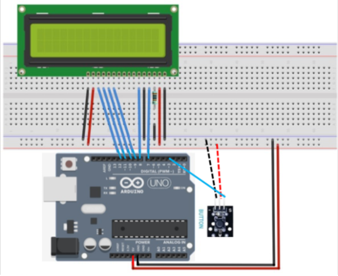

# Lab 10 - Version Control with GitHub
## lcd-lab-kylemiller
Kyle Miller (1143207)
April 15th
LCD display project for IoT lab.
Hardware setup is an Elegoo UNO R3, a button and the 2x16 LCD screen.

\
Figure 1: Hardware and connections setup needed for the LCD lab.
